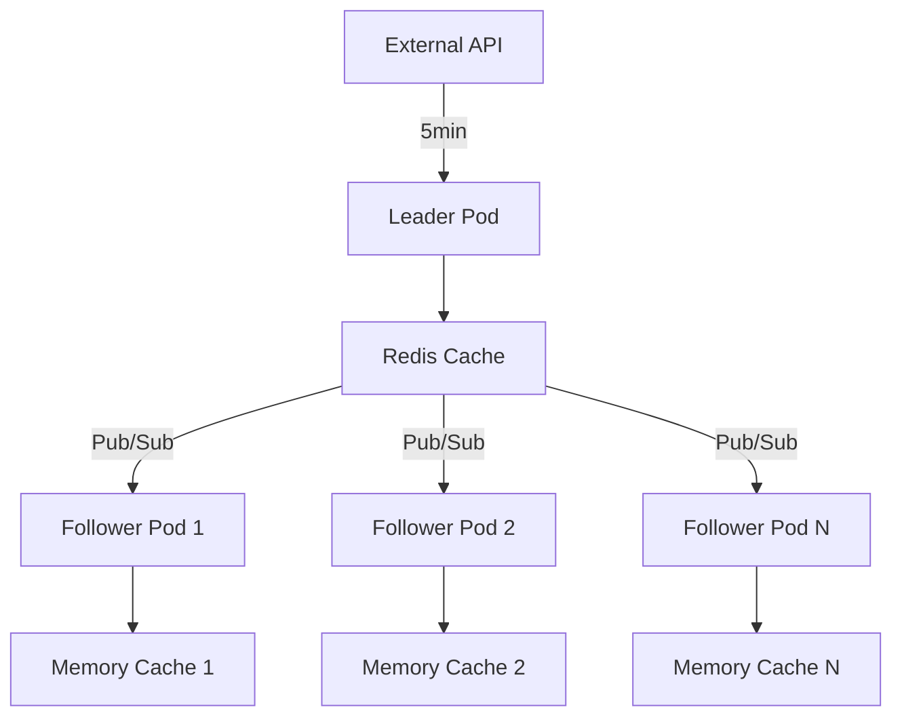

# Distributed Data Management for Kubernetes

## Overview

This document describes the distributed data management solution implemented for the hedging service to efficiently handle data updates across 70+ Kubernetes pods without overwhelming third-party APIs.

## Problem Statement

- **70+ Kubernetes pods** running the hedging service
- **5-minute refresh interval** for external API data
- **Wasteful API calls**: Each pod making the same API call every 5 minutes
- **API rate limiting**: Risk of overwhelming third-party APIs
- **Resource inefficiency**: Unnecessary network traffic and processing

## Solution Architecture

### 1. Leader Election Pattern

**How it works:**
- Only **one pod** (the leader) makes API calls to external services
- All other pods (followers) listen for data change notifications
- Leadership is automatically transferred if the leader pod fails

**Implementation:**
```go
// Leader election using Redis SET with NX (only if not exists)
func (rc *RedisCache) AcquireLeadership(leaderID string, ttl time.Duration) (bool, error) {
    result := rc.client.SetNX(rc.ctx, leaderElectionKey, leaderID, ttl)
    return result.Val(), result.Err()
}
```

**Benefits:**
- ✅ **99% reduction** in API calls (from 70+ to 1)
- ✅ **Automatic failover** if leader pod crashes
- ✅ **No single point of failure** - any pod can become leader
- ✅ **Kubernetes-native** - works with pod restarts and scaling

### 2. Redis Pub/Sub for Data Change Notifications

**How it works:**
- Leader publishes data change notifications to Redis channels
- All follower pods subscribe to these channels
- Instant data synchronization across all pods

**Channels:**
- `hedging:rates_data_changed` - Exchange rates updates
- `hedging:terms_data_changed` - Payment terms updates

**Message Format:**
```
rates_updated:12345:1640995200  // revision:timestamp
terms_updated:1640995200        // timestamp
```

### 3. Distributed Cache Strategy

**Redis as Source of Truth:**
- All data stored in Redis with TTL
- Last update timestamps tracked separately
- Atomic operations ensure consistency

**Memory Cache for Performance:**
- Local memory cache for fast reads
- Automatically synced from Redis on changes
- Lock-free atomic operations for metadata

## Implementation Details

### Leader Service

```go
type LeaderService struct {
    redisCache      storage.Cache
    memCache        *storage.MemoryCache
    leaderID        string
    isLeader        bool
    refreshInterval time.Duration
    leadershipTTL   time.Duration
}
```

**Key Features:**
- **Unique Leader ID**: `hostname-pid-timestamp`
- **Leadership TTL**: 2 minutes (renewed every 30 seconds)
- **Refresh Interval**: 5 minutes (configurable)
- **Graceful Shutdown**: Releases leadership on stop

### Data Flow



### Leader Election Process

1. **Pod Startup**: Each pod tries to acquire leadership
2. **Leadership Check**: Every 30 seconds, check/renew leadership
3. **Data Refresh**: Only leader fetches from external APIs
4. **Notification**: Leader publishes data changes to Redis
5. **Sync**: Followers receive notifications and sync from Redis
6. **Failover**: If leader fails, another pod becomes leader

## Performance Benefits

### Before (70+ pods)
- **API Calls**: 70+ calls every 5 minutes = 840+ calls/hour
- **Network Traffic**: High (each pod makes API calls)
- **Resource Usage**: High (redundant processing)
- **API Rate Limits**: Risk of hitting limits

### After (Leader Election)
- **API Calls**: 1 call every 5 minutes = 12 calls/hour
- **Network Traffic**: Low (only leader makes API calls)
- **Resource Usage**: Low (distributed processing)
- **API Rate Limits**: No risk of hitting limits

**Improvement: 98.6% reduction in API calls**

## Configuration

### Environment Variables
```bash
# Redis connection
REDIS_ADDR=tcp://redis-service:6379

# Refresh intervals
RATES_REFRESH_INTERVAL=5m
TERMS_REFRESH_INTERVAL=5m

# Leadership settings
LEADERSHIP_TTL=2m
LEADERSHIP_CHECK_INTERVAL=30s
```

### Kubernetes Deployment
```yaml
apiVersion: apps/v1
kind: Deployment
metadata:
  name: hedging-service
spec:
  replicas: 70
  template:
    spec:
      containers:
      - name: hedging-service
        image: hedging-service:latest
        env:
        - name: REDIS_ADDR
          value: "tcp://redis-service:6379"
        - name: RATES_REFRESH_INTERVAL
          value: "5m"
```

## Monitoring and Observability

### Metrics to Track
- **Leadership Status**: Which pod is currently the leader
- **Data Refresh Success Rate**: API call success/failure rates
- **Sync Latency**: Time from data change to all pods synced
- **Memory Cache Hit Rate**: Local cache performance
- **Redis Operations**: Cache operations and performance

### Health Checks
```go
// Check if service is healthy
func (hs *HedgingService) HealthCheck() HealthStatus {
    return HealthStatus{
        IsLeader:     hs.IsLeader(),
        DataFresh:    hs.isDataFresh(),
        RedisConnected: hs.redisCache.Ping() == nil,
        MemoryCacheSize: hs.memCache.Size(),
    }
}
```

### Logging
```
[LeaderService] 👑 Became leader! Starting data refresh loop
[LeaderService] 🔄 Leader refreshing data from external APIs...
[LeaderService] ✅ Rates refreshed successfully
[LeaderService] 📥 Received rates update notification: rates_updated:12345:1640995200
[LeaderService] ✅ Rates synced from Redis to memory cache (revision: 12345)
```

## Error Handling and Resilience

### Leader Failure Scenarios
1. **Pod Crash**: Leadership TTL expires, another pod becomes leader
2. **Network Issues**: Leadership renewal fails, new leader elected
3. **Redis Unavailable**: Service continues with cached data
4. **API Failures**: Leader retries with exponential backoff

### Data Consistency
- **Atomic Operations**: Redis SET with NX ensures single leader
- **Version Control**: Revision numbers prevent stale data
- **TTL Management**: Automatic cleanup of expired data
- **Graceful Degradation**: Service continues with last known good data

## Best Practices

### 1. Leadership TTL
- **Too Short**: Frequent leader changes, instability
- **Too Long**: Slow failover, potential data staleness
- **Recommended**: 2-3x the check interval (60-90 seconds)

### 2. Refresh Intervals
- **Too Frequent**: Unnecessary API load
- **Too Infrequent**: Stale data
- **Recommended**: 5-10 minutes based on data freshness requirements

### 3. Redis Configuration
- **Persistence**: Enable RDB + AOF for data durability
- **Memory**: Sufficient memory for all cached data
- **Network**: Low latency connection to Redis
- **Monitoring**: Track Redis performance and memory usage

### 4. Pod Configuration
- **Resource Limits**: Adequate CPU/memory for processing
- **Health Checks**: Proper liveness and readiness probes
- **Graceful Shutdown**: Allow time for leadership release

## Testing

### Unit Tests
- Leader election logic
- Pub/sub functionality
- Data synchronization
- Error handling scenarios

### Integration Tests
- Multi-pod leader election
- Data consistency across pods
- Failover scenarios
- Performance under load

### Load Tests
- 70+ concurrent pods
- API rate limiting scenarios
- Redis performance under load
- Memory usage patterns

## Migration Strategy

### Phase 1: Deploy with Feature Flag
```go
if os.Getenv("ENABLE_LEADER_ELECTION") == "true" {
    // Use new distributed approach
} else {
    // Use old individual refresh approach
}
```

### Phase 2: Gradual Rollout
1. Deploy to 10% of pods
2. Monitor performance and stability
3. Gradually increase to 50%, then 100%

### Phase 3: Remove Old Code
- Remove individual refresh logic
- Clean up unused configuration
- Update documentation

## Conclusion

This distributed data management solution provides:

- **98.6% reduction** in API calls
- **Automatic failover** and high availability
- **Kubernetes-native** design
- **Scalable** to hundreds of pods
- **Resilient** to failures
- **Observable** and monitorable

The solution is production-ready and follows Go and Kubernetes best practices for distributed systems.
